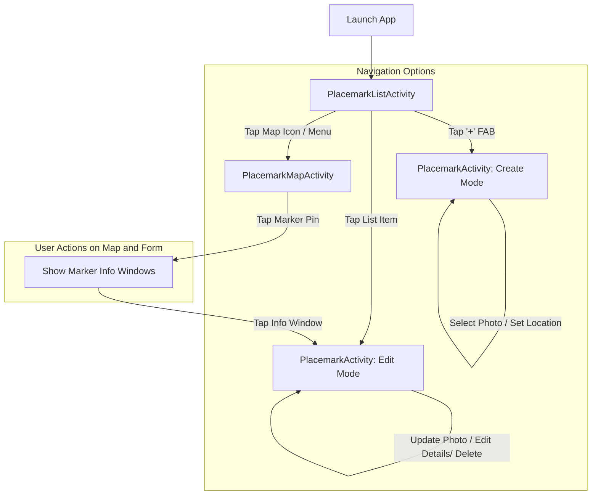

# ParcelPin Navigation and Activity Flow

```mermaid
flowchart TD
    A[Launch App] --> B[PlacemarkListActivity]
    
    subgraph Navigation Options 
        B -->|Tap '+' FAB| C[PlacemarkActivity: Create Mode]
        B -->|Tap List Item| D[PlacemarkActivity: Edit Mode]
        B -->|Tap Map Icon / Menu| E[PlacemarkMapActivity]
    end
    
    subgraph User Actions on Map and Form 
        C -->|Select Photo / Set Location| C
        D -->|Update Photo / Edit Details/ Delete| D
        E -->|Tap Marker Pin| F[Show Marker Info Windows]
        F -->|Tap Info Window| D
    end
```