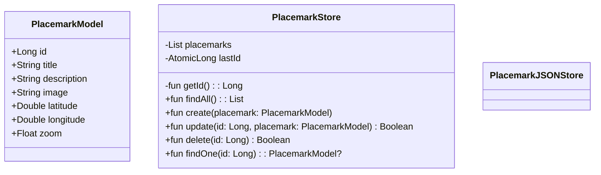

# ParcelPin Class Diagram

```mermaid
classDiagram
    class PlacemarkModel {
        +Long id
        +String title
        +String description
        +String image
        +Double latitude
        +Double longitude
        +Float zoom
    }
    
    class PlacemarkStore {
        -List<PlacemarkModel> placemarks
        -AtomicLong lastId
        -fun getId(): Long
        +fun findAll(): List<PlacemarkModel>
        +fun create(placemark: PlacemarkModel)
        +fun update(id: Long, placemark: PlacemarkModel) Boolean
        +fun delete(id: Long) Boolean
        +fun findOne(id: Long): PlacemarkModel?
    }
    
    class PlacemarkJSONStore {
    
    }
    
    
```